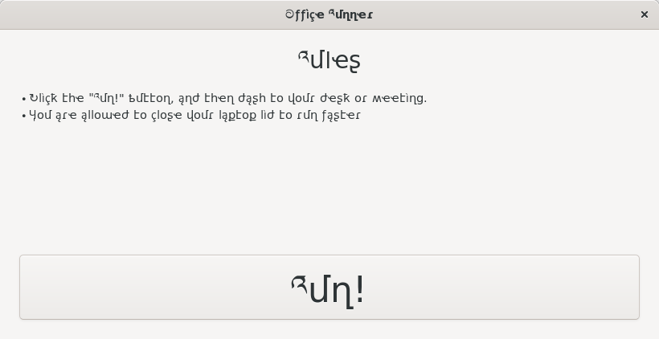

gettext-pseudolocale mangles English/ASCII text into
something that makes internationalisation issues obvious, similarly
to [Android's pseudolocales feature](https://developer.android.com/guide/topics/resources/pseudolocales).

This is implemented as an `LD_PRELOAD` shared library.



Building
--------

```sh
$ mkdir build
$ cd build
$ meson ..
$ ninja
```

Usage
-----

```
LD_PRELOAD=gettext-pseudolocale.so myapplication
```

Technical details
-----------------

The shared library overrides libintl calls, which are usually part
of the glibc DSO on Linux systems. This software has not been tested
on anything but Linux.

License
-------

This code is under the same license as the glibc itself
(GNU Lesser General Public License v 2.1)

See the glibc license for details:
http://www.gnu.org/software/libc/manual/html_mono/libc.html#Copying

The current mangle table is based on the “Bent” effect from Lunicode.js,
see `bent.h` for details.

Copyright
---------

Copyright Bastien Nocera <<hadess@hadess.net>> 2019
